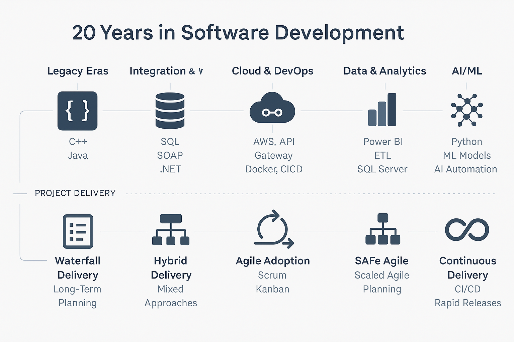

# 😄 Hi, I'm Corie Smitka

I’m a dynamic and resilient software engineer, data analyst, and woman in STEM with over 20 years of experience building secure, scalable, enterprise-grade systems. My passion lies in making data come alive — not just through dashboards, but through purpose-driven analytics that reveal deeper patterns, context, and insight.

Throughout my career, I’ve thrived at the intersection of software integration, system architecture, and data transformation — bringing together legacy technologies, modern cloud stacks, and evolving delivery frameworks. My background in engineering has given me the privilege of deeply understanding the “how” behind the systems — and now, I’m applying that to the “why” through meaningful, analytics-driven solutions.

After navigating a personal journey of stroke recovery, I’ve reignited my career by combining that core engineering foundation with machine learning, Power BI, and cloud platforms. I continue to evolve — driven not only by technical curiosity, but by a mission to build inclusive, intelligent, and real-world impact systems.

---

## 🔭 Current Projects
- 

  
<strong>🔥 Flames Player Development Analysis</strong> — <em>(Private – Structure Preview Only)</em>

  A structured, end-to-end project built around NHL and PWHL player development pipelines:

  - NHL API integration (roster, player, game logs)
  - Power BI dashboards for performance tracking
  - ML-based growth modeling for player comparison
  - Gender equity analysis inspired by *Invisible Women*
  - SQL-based performance views and filtered pipelines for Power BI
  - GitHub integration with templated public/private structure

  This project merges my technical background with my passion for **sports analytics** and **gender inclusion in STEM** — using data to identify growth trends, disparities, and opportunities across men’s and women’s hockey.

  🔗 [View Repo (Structure Only)](https://github.com/coriesmitka/flames-player-development-template)

  

- 

  
<strong>:ice_hockey:PWHL + Women’s Hockey Data Integration</strong>

  Companion project to bring visibility and structure to women’s hockey data.  
  Focused on **data normalization, visibility equity**, and **eventual ML comparison** with men’s data.  
  Technologies: **Python, JSON APIs, data modeling**

  

- 

  
<strong>⚖️Bias Mitigation in ML Models (Personal Learning Project)</strong>

  As part of expanding into **Responsible AI**, this project explores bias detection and mitigation using real-world datasets.  
  Toolkit exploration includes: **IBM AI Fairness 360**, **What-If Tool**, and **model auditing techniques**.  
  📚 Also paired with current course learnings in ethical ML design.

  

  
---

## 🧠 What I'm Learning

Continuous growth is a core part of my engineering mindset — I'm currently expanding into cloud-native data workflows, analytics visualization, machine learning, and responsible AI.

- 

  
<strong>📦 AWS Data Engineer Certification</strong>

  
  Building serverless pipelines, event-driven processing, and scalable analytics architecture on AWS.  
  Focus areas include:
  - **AWS Lambda**, **API Gateway**, and **DynamoDB** for serverless compute and integration  
  - **Glue**, **Athena**, **Redshift**, and **EMR** for data processing, transformation, and warehousing  
  - **S3-based Data Lakes** for storage, cataloging, and querying structured and semi-structured data  
  - Applying cloud-native best practices for secure, efficient data pipelines
  
  

- 

  
<strong>📊 Microsoft Power BI Data Analyst</strong>

  Designing actionable dashboards and enterprise semantic models.  
  Learning advanced **DAX**, **data shaping**, and **model-driven insights** for business storytelling.
  

- 

  
<strong>☁️ Microsoft Azure AI Fundamentals (AI-900)</strong>

  Exploring the foundational concepts of **AI, machine learning**, and **natural language processing** within Azure’s ecosystem.  
  Topics include:
  - Core ML types: **classification**, **regression**, and **clustering**
  - Overview of **Azure AI services**: Vision, Speech, Language, and Decision APIs
  - Understanding **Responsible AI** principles: fairness, accountability, transparency, and privacy
  - Real-world use cases for AI in **healthcare**, **finance**, and **public sector solutions**
  
  The course supports a deeper commitment to **trustworthy AI design** and data ethics in applied environments.

  

- 

  
<strong>🐍 Microsoft Python Developer Certification</strong>

  Reinforcing clean Python development practices with emphasis on readability, maintainability, and data use cases.  
  Covers functions, classes, file I/O, modules, and intro-level data work.
  

- 

  
<strong>🧠 Applied Machine Learning</strong>

  Studying real-world ML workflows focused on **data preparation**, **model building**, and **evaluation** in Python.  
  Areas of focus include:
  - Core models: **time-series forecasting**, **linear regression**, **logistic regression**, and **classification algorithms**
  - Tools: **scikit-learn**, **pandas**, **NumPy**, and **Matplotlib/Seaborn** for exploratory analysis and model prototyping
  - Evaluation methods: **cross-validation**, **confusion matrix**, **ROC curves**, and **accuracy/recall trade-offs**
  - Early-stage planning for integrating ML insights into the **Flames Player Development Analysis** project to support predictive growth modeling

  This work bridges software engineering expertise with machine learning — adding depth to my evolving data science skill set.

  

- 

  
<strong>🧮 Simulation Modeling in Sports Analytics</strong>

  Using **mathematical modeling** to simulate player development, team dynamics, and competitive performance.  
  Current areas of exploration include:
  - Building and solving **differential equations** to model growth over time
  - Mapping data-derived trends into **predictive simulation frameworks**
  - Exploring resistance factors such as fatigue, injury (proxy via injury APIs), or line changes
  - Applying theoretical models to **NHL and PWHL player performance** trajectories

  This layer blends systems engineering, applied mathematics, and performance data into real-world insights.

  

- 

  
<strong>🌐 GitHub Portfolio & Data Storytelling</strong>

  Designing a structured, narrative-rich GitHub presence to showcase real-world data projects.  
  Focus on **readme design**, **visual consistency**, and **data transparency**.
  

---
## 🧰 Tech Stack

### 💻 Software Development

### 🛠️ Data Engineering

### 📊 Data Analysis & Visualization

### ☁️ Cloud Platforms & Services

### 🧠 Machine Learning & Data Science
 
### 🔧 DevOps & Tooling

### 🧰 Other Technologies 

--- 

### 🌍 About Me and My Tech Journey

  
<strong> Expand to read full story</strong>

   
I’ve spent the last 20 years riding the pulse of technology — growing alongside it, adapting through every shift, and leading through each transformation.

My early career was rooted in on-prem systems and monolithic applications, where I worked on large-scale enterprise solutions using C/C++, Java, and SQL. These projects were delivered in high-stakes, waterfall environments — often multi-year initiatives where I led complex planning, stakeholder alignment, and delivery assurance across tightly coupled systems.

As the tech world shifted toward integration, cloud, and agility, so did I. I moved from traditional release models into SAFe Agile, embracing iterative delivery, feature-driven roadmaps, and CI/CD pipelines to deliver faster, smarter, and with reduced risk. My hands-on development evolved into leadership roles — guiding teams through DevOps adoption, cloud-native architectures, and enterprise-level transformation programs.

From legacy to cloud, from project plans to pipelines, my journey reflects a dual mastery: technology execution and delivery excellence.

Today, I focus on the frontier of data, machine learning, and AI — designing solutions that are not only intelligent, but strategic.

I don’t just work with technology — I grow with it.
And I bring that evolution to every team I join.

--- 

## 🏅 Certifications & In Progress

### ✅ Verified Certifications  🔗 [See all on Credly](https://www.credly.com/users/corie-smitka)

---

### 🛠 Currently Pursuing
-232F3E?style=for-the-badge&logo=amazonaws&logoColor=white)

-FFC000?style=for-the-badge&logo=powerbi&logoColor=black)

-0078D4?style=for-the-badge&logo=microsoftazure&logoColor=white)

-0078D4?style=for-the-badge&logo=python&logoColor=white)

---

## 📫 Connect With Me

- [LinkedIn](https://www.linkedin.com/in/coriesmitka)
- [GitHub](https://github.com/coriesmitka)

---

