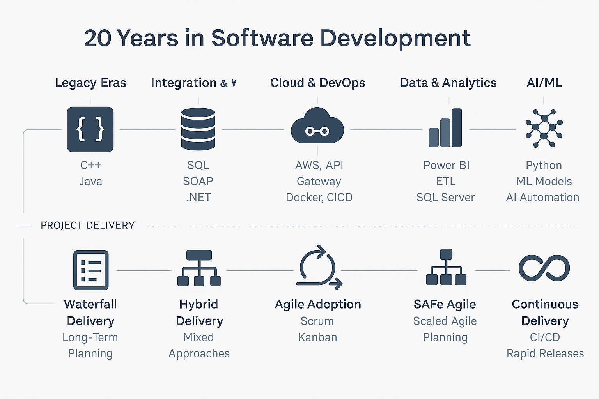

# 😄 Hi, I'm Corie Smitka

I’m a Systems Analyst, Software Engineer, and DevOps professional with over 20 years of experience designing secure, scalable enterprise solutions across cloud and on-premise environments.

My passion lies in systems design—understanding how people, processes, and technology come together to create reliable, maintainable, and meaningful software. From software engineering and infrastructure automation to AI-assisted workflows and cloud architecture, I enjoy building solutions that are thoughtful, practical, and designed to evolve.

I believe the best software begins with understanding the system first. Technology is simply the tool that brings that vision to life.

Today, I'm continuing to expand my knowledge in Android development, artificial intelligence, cloud technologies, and modern software architecture through hands-on personal projects and continuous learning.

---
## 🔭 Current Projects

- 

  
<strong>🧩 Project Mosaic</strong> — <em>(Private Repository – Public Overview)</em>

  Project Mosaic is a personal Android software project exploring AI-assisted workflows, modern mobile architecture, and privacy-first software design.

  The project is being built from the ground up using an iterative, systems-first approach with a focus on creating reliable, maintainable, and user-centered software.

  **Current Areas of Exploration**

  - Android application development
  - Kotlin and Jetpack libraries
  - Local-first architecture
  - Speech-to-text workflows
  - AI-assisted structured information processing
  - Privacy by Design
  - Security by Design
  - Clean software architecture
  - Offline-first design principles

  🚧 **Current Status**

  Early architectural design and foundation planning are currently underway.

  The project is intentionally being developed in small, iterative phases, with each release focused on building a strong architectural foundation before introducing additional capabilities.

  🔗 Repository: *Currently Private*

  
---

## 🧠 What I'm Learning

Continuous growth is a core part of my engineering mindset — I'm currently expanding into cloud-native data workflows, analytics visualization, machine learning, and responsible AI.

- 

  
<strong>📦 AWS Data Engineer Certification</strong>

  
  Building serverless pipelines, event-driven processing, and scalable analytics architecture on AWS.  
  Focus areas include:
  - **AWS Lambda**, **API Gateway**, and **DynamoDB** for serverless compute and integration  
  - **Glue**, **Athena**, **Redshift**, and **EMR** for data processing, transformation, and warehousing  
  - **S3-based Data Lakes** for storage, cataloging, and querying structured and semi-structured data  
  - Applying cloud-native best practices for secure, efficient data pipelines
  
  

- 

  
<strong>📊 Microsoft Power BI Data Analyst</strong>

  Designing actionable dashboards and enterprise semantic models.  
  Learning advanced **DAX**, **data shaping**, and **model-driven insights** for business storytelling.
  

- 

  
<strong>☁️ Microsoft Azure AI Fundamentals (AI-900)</strong>

  Exploring the foundational concepts of **AI, machine learning**, and **natural language processing** within Azure’s ecosystem.  
  Topics include:
  - Core ML types: **classification**, **regression**, and **clustering**
  - Overview of **Azure AI services**: Vision, Speech, Language, and Decision APIs
  - Understanding **Responsible AI** principles: fairness, accountability, transparency, and privacy
  - Real-world use cases for AI in **healthcare**, **finance**, and **public sector solutions**
  
  The course supports a deeper commitment to **trustworthy AI design** and data ethics in applied environments.

  

- 

  
<strong>🧠 Applied Machine Learning</strong>

  Studying real-world ML workflows focused on **data preparation**, **model building**, and **evaluation** in Python.  
  Areas of focus include:
  - Core models: **time-series forecasting**, **linear regression**, **logistic regression**, and **classification algorithms**
  - Tools: **scikit-learn**, **pandas**, **NumPy**, and **Matplotlib/Seaborn** for exploratory analysis and model prototyping
  - Evaluation methods: **cross-validation**, **confusion matrix**, **ROC curves**, and **accuracy/recall trade-offs**
  - Early-stage planning for integrating ML insights into the **Flames Player Development Analysis** project to support predictive growth modeling

  This work bridges software engineering expertise with machine learning — adding depth to my evolving data science skill set.

  

- 

  
<strong>🧮 Simulation Modeling in Sports Analytics</strong>

  Using **mathematical modeling** to simulate player development, team dynamics, and competitive performance.  
  Current areas of exploration include:
  - Building and solving **differential equations** to model growth over time
  - Mapping data-derived trends into **predictive simulation frameworks**
  - Exploring resistance factors such as fatigue, injury (proxy via injury APIs), or line changes
  - Applying theoretical models to **NHL and PWHL player performance** trajectories

  This layer blends systems engineering, applied mathematics, and performance data into real-world insights.

  

- 

  
<strong>🌐 GitHub Portfolio & Data Storytelling</strong>

  Designing a structured, narrative-rich GitHub presence to showcase real-world data projects.  
  Focus on **readme design**, **visual consistency**, and **data transparency**.
  

- 

  
<strong>🤖 Simulated Robotics & Voice AI (Robo AI)</strong>

  Building and training a virtual robot to walk and talk using **Webots**, **Python**, and AI speech interfaces.  
  This project explores the intersection of **robotic motion control**, **voice interaction**, and **simulation environments**.

  Key learning areas:
  - Robot behavior scripting with **Webots** and Python controllers
  - Integrating offline speech recognition with **Vosk** for command parsing
  - Using **pyttsx3** and **gTTS** for verbal output and human-like interaction
  - Designing modular control systems with future expansion into:
    - **Unity ML-Agents** for reinforcement learning
    - **Isaac Sim** for photorealistic training
    - **Real-world deployment** on Raspberry Pi or Petoi Bittle

  This hands-on exploration brings together multiple learning paths — including simulation, speech interfaces, ML, and hardware planning — under a unified robotics training project.
  

  
---
## 🧰 Tech Stack

### 💻 Software Development

### 🛠️ Data Engineering

### 📊 Data Analysis & Visualization

### ☁️ Cloud Platforms & Services

### 🧠 Machine Learning & Data Science
 
### 🔧 DevOps & Tooling

### 🧰 Other Technologies 

--- 

### 🌍 About Me and My Tech Journey

  
<strong> Expand to read full story</strong>

   
I’ve spent the last 20 years riding the pulse of technology — growing alongside it, adapting through every shift, and leading through each transformation.

My early career was rooted in on-prem systems and monolithic applications, where I worked on large-scale enterprise solutions using C/C++, Java, and SQL. These projects were delivered in high-stakes, waterfall environments — often multi-year initiatives where I led complex planning, stakeholder alignment, and delivery assurance across tightly coupled systems.

As the tech world shifted toward integration, cloud, and agility, so did I. I moved from traditional release models into SAFe Agile, embracing iterative delivery, feature-driven roadmaps, and CI/CD pipelines to deliver faster, smarter, and with reduced risk. My hands-on development evolved into leadership roles — guiding teams through DevOps adoption, cloud-native architectures, and enterprise-level transformation programs.

From legacy to cloud, from project plans to pipelines, my journey reflects a dual mastery: technology execution and delivery excellence.

Today, I focus on the frontier of data, machine learning, and AI — designing solutions that are not only intelligent, but strategic.

I don’t just work with technology — I grow with it.
And I bring that evolution to every team I join.

--- 

## 🏅 Certifications & In Progress

### ✅ Verified Certifications  
🔗 [See All on Credly](https://www.credly.com/users/corie-smitka)

---

### 🛠 Currently Pursuing
-232F3E?style=for-the-badge&logo=amazonaws&logoColor=white)
-FFC000?style=for-the-badge&logo=powerbi&logoColor=black)
-0078D4?style=for-the-badge&logo=microsoftazure&logoColor=white)

---

## 📫 Connect With Me

- [LinkedIn](https://www.linkedin.com/in/coriesmitka)
- [GitHub](https://github.com/coriesmitka)

---

